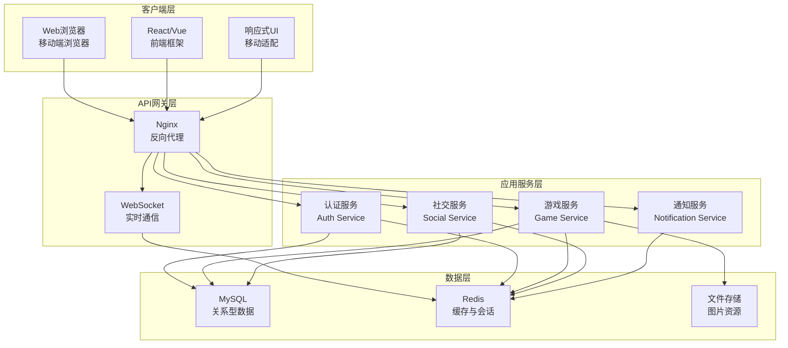

# QQ风格农场游戏技术设计

Feature Name: qq-style-farm-game
Updated: 2026-06-07

## 描述

一个多人在线的社交农场游戏，支持移动端和桌面端访问。玩家可以种植作物、养殖动物、装饰农场，并与好友进行社交互动。游戏采用前后端分离架构，支持实时数据同步和跨设备访问。

## 架构

### 系统架构图



### 技术栈

**前端**
- React.js + TypeScript
- Tailwind CSS (响应式设计)
- Socket.io-client (实时通信)
- Axios (HTTP请求)

**后端**
- Node.js + Express.js
- Socket.io (WebSocket服务)
- JWT (身份认证)
- PM2 (进程管理)

**数据库**
- MySQL 8.0 (关系型数据)
- Redis 7.0 (缓存、会话、排行榜)

**基础设施**
- Nginx (反向代理、静态文件服务)
- Docker (容器化部署)

## 组件和接口

### 前端组件

#### 页面组件

**FarmView (主农场页面)**
- 显示玩家农场全景
- 渲染土地网格
- 渲染装饰物
- 显示作物和动物状态
- 响应式布局适配移动端

接口：
```typescript
interface FarmViewProps {
  userId: string;
  farmData: FarmData;
  decorations: Decoration[];
}

interface FarmData {
  id: string;
  plots: Plot[];
  animalPens: AnimalPen[];
  decorations: Decoration[];
}
```

**LandPlot (土地组件)**
- 显示单块土地状态
- 支持种植、收获交互
- 显示作物生长进度
- 动画效果（生长、收获）

接口：
```typescript
interface LandPlotProps {
  plot: Plot;
  onPlant: (seedId: string) => void;
  onHarvest: () => void;
  onClick: () => void;
}

interface Plot {
  id: string;
  level: number;
  crop: Crop | null;
  lastHarvestTime: number;
}
```

**AnimalPen (动物栏组件)**
- 显示动物栏状态
- 支持喂养、收集产品
- 显示动物饥饿度和产出进度
- 动画效果

接口：
```typescript
interface AnimalPenProps {
  pen: AnimalPen;
  onFeed: (animalId: string) => void;
  onCollect: (productId: string) => void;
}

interface AnimalPen {
  id: string;
  level: number;
  animals: Animal[];
  maxCapacity: number;
}
```

**Shop (商店组件)**
- 分类显示商品
- 商品详情弹窗
- 购买交互
- 移动端卡片式布局

接口：
```typescript
interface ShopProps {
  category: 'seeds' | 'animals' | 'decorations' | 'items';
  onPurchase: (itemId: string, quantity: number) => void;
}

interface ShopItem {
  id: string;
  name: string;
  price: number;
  levelRequired: number;
  category: string;
  icon: string;
}
```

**Inventory (背包组件)**
- 分页显示物品
- 使用物品交互
- 出售物品
- 移动端底部抽屉式布局

接口：
```typescript
interface InventoryProps {
  items: InventoryItem[];
  onUse: (itemId: string) => void;
  onSell: (itemId: string, quantity: number) => void;
}

interface InventoryItem {
  itemId: string;
  quantity: number;
  itemType: 'seed' | 'animal' | 'product' | 'decoration' | 'item';
}
```

**SocialPanel (社交面板)**
- 好友列表
- 访问好友农场
- 帮忙和偷菜操作
- 亲密度显示

接口：
```typescript
interface SocialPanelProps {
  friends: Friend[];
  onVisit: (friendId: string) => void;
  onHelp: (friendId: string, targetId: string) => void;
  onSteal: (friendId: string, targetId: string) => void;
}
```

**QuestPanel (任务面板)**
- 日常任务列表
- 成就任务
- 任务进度显示
- 任务奖励领取

接口：
```typescript
interface QuestPanelProps {
  quests: Quest[];
  onSubmit: (questId: string) => void;
}

interface Quest {
  id: string;
  type: 'daily' | 'achievement' | 'special';
  title: string;
  description: string;
  progress: number;
  target: number;
  rewards: Reward[];
}
```

#### UI组件

**ProgressBar (进度条)**
- 显示作物生长进度
- 显示动物产出进度
- 动画效果

**NotificationCard (通知卡片)**
- 显示最新通知
- 点击跳转
- 已读/未读状态

**Modal (模态框)**
- 通用弹窗组件
- 支持自定义内容
- 移动端全屏模式

**BottomNav (底部导航)**
- 移动端主导航
- 图标切换
- 响应式隐藏（桌面端）

### 后端服务

**AuthService (认证服务)**
- 用户注册/登录
- JWT token生成和验证
- 会话管理
- 密码加密存储

接口：
```typescript
// POST /api/auth/register
interface RegisterRequest {
  username: string;
  password: string;
  email: string;
}

// POST /api/auth/login
interface LoginRequest {
  username: string;
  password: string;
}

interface LoginResponse {
  token: string;
  user: UserProfile;
}
```

**GameService (游戏核心服务)**
- 土地操作（种植、收获）
- 动物操作（喂养、收集）
- 等级和经验管理
- 金币交易

接口：
```typescript
// POST /api/game/plant
interface PlantRequest {
  plotId: string;
  seedId: string;
  fertilizerId?: string;
}

// POST /api/game/harvest
interface HarvestRequest {
  plotId: string;
}

// POST /api/game/feed-animal
interface FeedAnimalRequest {
  animalId: string;
  feedId: string;
}

// POST /api/game/collect-product
interface CollectProductRequest {
  animalId: string;
}
```

**SocialService (社交服务)**
- 好友管理
- 访问农场
- 帮忙和偷菜
- 亲密度计算

接口：
```typescript
// GET /api/social/friends
interface GetFriendsResponse {
  friends: Friend[];
}

// POST /api/social/visit
interface VisitRequest {
  friendId: string;
}

// POST /api/social/help
interface HelpRequest {
  friendId: string;
  targetId: string;
  targetType: 'crop' | 'animal';
}

// POST /api/social/steal
interface StealRequest {
  friendId: string;
  targetId: string;
  targetType: 'crop';
}
```

**NotificationService (通知服务)**
- 实时通知推送
- 通知历史查询
- 通知标记已读

接口：
```typescript
// GET /api/notifications
interface GetNotificationsResponse {
  notifications: Notification[];
  unreadCount: number;
}

// PUT /api/notifications/:id/read
interface MarkAsReadResponse {
  success: boolean;
}
```

**ShopService (商店服务)**
- 商品列表查询
- 购买物品
- 出售物品

接口：
```typescript
// GET /api/shop/items
interface GetShopItemsRequest {
  category?: string;
}

interface GetShopItemsResponse {
  items: ShopItem[];
}

// POST /api/shop/purchase
interface PurchaseRequest {
  itemId: string;
  quantity: number;
}

// POST /api/shop/sell
interface SellRequest {
  itemId: string;
  quantity: number;
}
```

### WebSocket事件

**实时事件**

```typescript
// 客户端 -> 服务器
interface ClientEvents {
  'join-game': (userId: string) => void;
  'plant-crop': (data: PlantRequest) => void;
  'harvest-crop': (data: HarvestRequest) => void;
  'feed-animal': (data: FeedAnimalRequest) => void;
  'collect-product': (data: CollectProductRequest) => void;
  'visit-farm': (data: { friendId: string }) => void;
  'help-friend': (data: HelpRequest) => void;
  'steal-crop': (data: StealRequest) => void;
}

// 服务器 -> 客户端
interface ServerEvents {
  'crop-mature': (data: { plotId: string }) => void;
  'animal-product-ready': (data: { animalId: string }) => void;
  'friend-visit': (data: { friendId: string, friendName: string }) => void;
  'stolen-crop': (data: { plotId: string, thiefName: string }) => void;
  'quest-completed': (data: { questId: string }) => void;
  'level-up': (data: { newLevel: number, rewards: Reward[] }) => void;
  'notification': (notification: Notification) => void;
}
```

## 数据模型

### 用户数据

```sql
CREATE TABLE users (
  id VARCHAR(36) PRIMARY KEY,
  username VARCHAR(50) UNIQUE NOT NULL,
  email VARCHAR(100) UNIQUE NOT NULL,
  password_hash VARCHAR(255) NOT NULL,
  level INT DEFAULT 1,
  experience INT DEFAULT 0,
  coins INT DEFAULT 0,
  skill_points INT DEFAULT 0,
  created_at TIMESTAMP DEFAULT CURRENT_TIMESTAMP,
  last_login TIMESTAMP,
  settings JSON DEFAULT '{}'
);

CREATE INDEX idx_users_username ON users(username);
CREATE INDEX idx_users_level ON users(level);
```

### 农场数据

```sql
CREATE TABLE farms (
  id VARCHAR(36) PRIMARY KEY,
  user_id VARCHAR(36) NOT NULL,
  name VARCHAR(100) NOT NULL,
  decoration_theme VARCHAR(50) DEFAULT 'default',
  created_at TIMESTAMP DEFAULT CURRENT_TIMESTAMP,
  FOREIGN KEY (user_id) REFERENCES users(id) ON DELETE CASCADE
);

CREATE TABLE plots (
  id VARCHAR(36) PRIMARY KEY,
  farm_id VARCHAR(36) NOT NULL,
  position_x INT NOT NULL,
  position_y INT NOT NULL,
  level INT DEFAULT 1,
  crop_id VARCHAR(36),
  plant_time TIMESTAMP,
  harvest_time TIMESTAMP,
  fertilizer_used BOOLEAN DEFAULT FALSE,
  is_withered BOOLEAN DEFAULT FALSE,
  FOREIGN KEY (farm_id) REFERENCES farms(id) ON DELETE CASCADE
);

CREATE INDEX idx_plots_farm ON plots(farm_id);
CREATE INDEX idx_plots_crop ON plots(crop_id);
```

### 作物数据

```sql
CREATE TABLE crops (
  id VARCHAR(36) PRIMARY KEY,
  name VARCHAR(100) NOT NULL,
  level_required INT NOT NULL,
  seed_price INT NOT NULL,
  sell_price INT NOT NULL,
  growth_time INT NOT NULL, -- 分钟
  base_yield INT NOT NULL,
  icon VARCHAR(255),
  season VARCHAR(20) DEFAULT 'all'
);

CREATE TABLE crop_types (
  id VARCHAR(36) PRIMARY KEY,
  name VARCHAR(50) NOT NULL,
  variety VARCHAR(50) NOT NULL,
  base_crop_id VARCHAR(36),
  multiplier FLOAT DEFAULT 1.0
);
```

### 动物数据

```sql
CREATE TABLE animal_pens (
  id VARCHAR(36) PRIMARY KEY,
  farm_id VARCHAR(36) NOT NULL,
  level INT DEFAULT 1,
  max_capacity INT DEFAULT 3,
  FOREIGN KEY (farm_id) REFERENCES farms(id) ON DELETE CASCADE
);

CREATE TABLE animals (
  id VARCHAR(36) PRIMARY KEY,
  pen_id VARCHAR(36) NOT NULL,
  animal_type_id VARCHAR(36) NOT NULL,
  hunger_level INT DEFAULT 100, -- 0-100
  last_fed TIMESTAMP,
  product_progress INT DEFAULT 0,
  product_ready_time TIMESTAMP,
  FOREIGN KEY (pen_id) REFERENCES animal_pens(id) ON DELETE CASCADE
);

CREATE TABLE animal_types (
  id VARCHAR(36) PRIMARY KEY,
  name VARCHAR(100) NOT NULL,
  level_required INT NOT NULL,
  buy_price INT NOT NULL,
  feed_cost INT NOT NULL,
  production_time INT NOT NULL, -- 分钟
  product_id VARCHAR(36),
  icon VARCHAR(255)
);
```

### 装饰物数据

```sql
CREATE TABLE decorations (
  id VARCHAR(36) PRIMARY KEY,
  farm_id VARCHAR(36) NOT NULL,
  decoration_type_id VARCHAR(36) NOT NULL,
  position_x FLOAT NOT NULL,
  position_y FLOAT NOT NULL,
  rotation INT DEFAULT 0,
  FOREIGN KEY (farm_id) REFERENCES farms(id) ON DELETE CASCADE
);

CREATE TABLE decoration_types (
  id VARCHAR(36) PRIMARY KEY,
  name VARCHAR(100) NOT NULL,
  category VARCHAR(50) NOT NULL,
  price INT NOT NULL,
  level_required INT NOT NULL,
  icon VARCHAR(255),
  effect JSON DEFAULT '{}'
);
```

### 物品数据

```sql
CREATE TABLE inventory (
  id VARCHAR(36) PRIMARY KEY,
  user_id VARCHAR(36) NOT NULL,
  item_id VARCHAR(36) NOT NULL,
  quantity INT DEFAULT 0,
  FOREIGN KEY (user_id) REFERENCES users(id) ON DELETE CASCADE
);

CREATE TABLE items (
  id VARCHAR(36) PRIMARY KEY,
  name VARCHAR(100) NOT NULL,
  category VARCHAR(50) NOT NULL, -- seed, animal, product, item, decoration
  type_id VARCHAR(36) NOT NULL,
  base_price INT,
  stackable BOOLEAN DEFAULT TRUE,
  icon VARCHAR(255)
);

CREATE TABLE item_types (
  id VARCHAR(36) PRIMARY KEY,
  name VARCHAR(50) NOT NULL,
  effect JSON NOT NULL,
  duration INT, -- 效果持续时间（分钟）
  cooldown INT -- 冷却时间（分钟）
);
```

### 社交数据

```sql
CREATE TABLE friendships (
  id VARCHAR(36) PRIMARY KEY,
  user_id VARCHAR(36) NOT NULL,
  friend_id VARCHAR(36) NOT NULL,
  intimacy INT DEFAULT 0, -- 亲密度
  status ENUM('pending', 'accepted', 'blocked') DEFAULT 'pending',
  created_at TIMESTAMP DEFAULT CURRENT_TIMESTAMP,
  FOREIGN KEY (user_id) REFERENCES users(id) ON DELETE CASCADE,
  FOREIGN KEY (friend_id) REFERENCES users(id) ON DELETE CASCADE
);

CREATE TABLE social_activities (
  id VARCHAR(36) PRIMARY KEY,
  user_id VARCHAR(36) NOT NULL,
  target_user_id VARCHAR(36),
  activity_type ENUM('visit', 'help', 'steal', 'gift') NOT NULL,
  target_id VARCHAR(36),
  timestamp TIMESTAMP DEFAULT CURRENT_TIMESTAMP,
  FOREIGN KEY (user_id) REFERENCES users(id) ON DELETE CASCADE,
  FOREIGN KEY (target_user_id) REFERENCES users(id) ON DELETE CASCADE
);

CREATE INDEX idx_social_user ON social_activities(user_id);
CREATE INDEX idx_social_timestamp ON social_activities(timestamp);
```

### 任务数据

```sql
CREATE TABLE quests (
  id VARCHAR(36) PRIMARY KEY,
  title VARCHAR(200) NOT NULL,
  description TEXT NOT NULL,
  type ENUM('daily', 'achievement', 'special') NOT NULL,
  category VARCHAR(50) NOT NULL,
  condition JSON NOT NULL,
  target_value INT NOT NULL,
  rewards JSON NOT NULL,
  level_required INT DEFAULT 1,
  is_active BOOLEAN DEFAULT TRUE
);

CREATE TABLE user_quests (
  id VARCHAR(36) PRIMARY KEY,
  user_id VARCHAR(36) NOT NULL,
  quest_id VARCHAR(36) NOT NULL,
  progress INT DEFAULT 0,
  status ENUM('active', 'completed', 'claimed', 'expired') DEFAULT 'active',
  start_time TIMESTAMP DEFAULT CURRENT_TIMESTAMP,
  completion_time TIMESTAMP,
  FOREIGN KEY (user_id) REFERENCES users(id) ON DELETE CASCADE,
  FOREIGN KEY (quest_id) REFERENCES quests(id)
);

CREATE INDEX idx_user_quests_user ON user_quests(user_id);
CREATE INDEX idx_user_quests_status ON user_quests(status);
```

### 成就数据

```sql
CREATE TABLE achievements (
  id VARCHAR(36) PRIMARY KEY,
  title VARCHAR(200) NOT NULL,
  description TEXT NOT NULL,
  category VARCHAR(50) NOT NULL,
  condition JSON NOT NULL,
  target_value INT NOT NULL,
  rewards JSON NOT NULL,
  stages JSON, -- 多阶段成就
  icon VARCHAR(255)
);

CREATE TABLE user_achievements (
  id VARCHAR(36) PRIMARY KEY,
  user_id VARCHAR(36) NOT NULL,
  achievement_id VARCHAR(36) NOT NULL,
  progress INT DEFAULT 0,
  stage INT DEFAULT 1,
  unlocked BOOLEAN DEFAULT FALSE,
  unlocked_at TIMESTAMP,
  FOREIGN KEY (user_id) REFERENCES users(id) ON DELETE CASCADE,
  FOREIGN KEY (achievement_id) REFERENCES achievements(id)
);
```

### 通知数据

```sql
CREATE TABLE notifications (
  id VARCHAR(36) PRIMARY KEY,
  user_id VARCHAR(36) NOT NULL,
  type VARCHAR(50) NOT NULL,
  title VARCHAR(200) NOT NULL,
  message TEXT NOT NULL,
  data JSON,
  is_read BOOLEAN DEFAULT FALSE,
  created_at TIMESTAMP DEFAULT CURRENT_TIMESTAMP,
  FOREIGN KEY (user_id) REFERENCES users(id) ON DELETE CASCADE
);

CREATE INDEX idx_notifications_user ON notifications(user_id);
CREATE INDEX idx_notifications_read ON notifications(is_read);
CREATE INDEX idx_notifications_created ON notifications(created_at);
```

### 游戏配置

```sql
CREATE TABLE game_config (
  id VARCHAR(36) PRIMARY KEY,
  key VARCHAR(100) UNIQUE NOT NULL,
  value JSON NOT NULL,
  description TEXT,
  updated_at TIMESTAMP DEFAULT CURRENT_TIMESTAMP ON UPDATE CURRENT_TIMESTAMP
);

INSERT INTO game_config (id, key, value) VALUES
  ('1', 'economy', '{"coin_start": 1000, "level_up_coins": 100, "daily_bonus": 50}'),
  ('2', 'gameplay', '{"steal_ratio_max": 0.4, "help_ratio": 0.1, "visit_duration": 5}'),
  ('3', 'leveling', '{"exp_per_level": 100, "exp_multiplier": 1.2}');
```

## 正确性属性

### 不变量

1. **金币不变量**：玩家金币不能为负数
   - 每次交易前验证：`player.coins - cost >= 0`

2. **物品数量不变量**：背包中物品数量不能为负数
   - 每次使用/出售前验证：`item.quantity - amount >= 0`

3. **土地唯一性不变量**：每块土地在同一时间只能种植一种作物
   - 种植前检查：`plot.crop_id IS NULL`

4. **动物栏容量不变量**：每个动物栏的动物数量不能超过最大容量
   - 添加动物前检查：`pen.animals.length <= pen.maxCapacity`

5. **成长时间不变量**：作物的收获时间必须大于种植时间
   - 验证：`crop.harvest_time > crop.plant_time`

6. **经验值一致性不变量**：玩家等级对应的经验值必须正确
   - 验证：`level >= calculateLevel(experience)`

7. **社交关系不变量**：用户不能添加自己为好友
   - 验证：`friendship.user_id != friendship.friend_id`

8. **好友请求唯一性不变量**：两个用户之间只能有一个待处理的好友请求
   - 验证：`COUNT(friendships) <= 1 WHERE (user_id=A AND friend_id=B) OR (user_id=B AND friend_id=A)`

9. **任务状态不变量**：已完成的任务不能再次完成
   - 验证：`user_quest.status !== 'completed'`

10. **通知时间不变量**：通知的创建时间不能晚于当前时间
    - 验证：`notification.created_at <= NOW()`

### 约束

1. **作物枯萎约束**：作物超过收获时间2小时后自动枯萎
   - 定时任务每10分钟检查：`NOW() - harvest_time > 2 HOURS`

2. **动物饥饿约束**：动物不喂养超过4小时停止产出
   - 定时任务每10分钟检查：`NOW() - last_fed > 4 HOURS`

3. **日常任务重置约束**：未完成的日常任务在午夜重置
   - 定时任务每天00:00执行：`UPDATE user_quests SET progress=0 WHERE type='daily'`

4. **偷菜冷却约束**：同一好友的同一块土地，玩家每天只能偷一次
   - 验证：`COUNT(steals) == 0 WHERE thief_id=X AND friend_id=Y AND target_id=Z AND DATE(timestamp)=TODAY`

5. **访问时长约束**：访问好友农场最多5分钟
   - WebSocket断开或重定向：`visit_duration >= 5 MINUTES`

6. **等级解锁约束**：玩家只能使用当前等级或以下等级的物品
   - 验证：`player.level >= item.levelRequired`

7. **装饰物位置约束**：装饰物不能放置在与土地或动物重叠的位置
   - 验证：`!checkCollision(decoration, existingObjects)`

8. **亲密度上限约束**：亲密度最高为100
   - 验证：`intimacy <= 100`

## 错误处理

### 常见错误场景

**1. 认证错误**
- 错误码：AUTH_001
- 场景：无效的用户名或密码
- 处理：返回401状态码和错误信息
- 前端显示：登录失败，请检查用户名和密码

**2. 权限错误**
- 错误码：PERM_001
- 场景：玩家尝试操作其他玩家的农场
- 处理：返回403状态码
- 前端显示：您没有权限执行此操作

**3. 资源不足错误**
- 错误码：RES_001
- 场景：金币不足以购买物品
- 处理：返回400状态码和所需金币数量
- 前端显示：金币不足，还需要XX金币

**4. 资源已存在错误**
- 错误码：RES_002
- 场景：重复添加好友
- 处理：返回409状态码
- 前端显示：该用户已经是您的好友

**5. 资源未找到错误**
- 错误码：RES_003
- 场景：访问不存在的农场
- 处理：返回404状态码
- 前端显示：农场不存在

**6. 业务规则错误**
- 错误码：BIZ_001
- 场景：尝试在已有作物的土地上种植
- 处理：返回400状态码和错误详情
- 前端显示：该土地已有作物，请先收获或清除

**7. 网络错误**
- 错误码：NET_001
- 场景：WebSocket连接断开
- 处理：自动重连机制，最多重试3次
- 前端显示：网络连接断开，正在重连...

**8. 并发冲突**
- 错误码：CON_001
- 场景：多个玩家同时尝试偷取同一作物
- 处理：使用乐观锁，返回409状态码
- 前端显示：该作物已被其他人抢先

**9. 数据验证错误**
- 错误码：VAL_001
- 场景：前端提交的参数不符合要求
- 处理：返回400状态码和验证错误详情
- 前端显示：参数错误，请检查输入

**10. 服务器错误**
- 错误码：SRV_001
- 场景：数据库连接失败
- 处理：记录错误日志，返回500状态码
- 前端显示：服务器错误，请稍后重试

### 错误响应格式

```typescript
interface ErrorResponse {
  success: false;
  error: {
    code: string;
    message: string;
    details?: Record<string, any>;
    timestamp: number;
  };
}
```

### 重试策略

1. **网络请求重试**
   - GET请求：最多重试3次，指数退避（1s, 2s, 4s）
   - POST/PUT/DELETE请求：不自动重试，需要用户确认

2. **WebSocket重连**
   - 断线后立即尝试重连
   - 如果失败，每5秒重试一次，最多10次
   - 显示重连状态给用户

3. **事务回滚**
   - 数据库操作失败时自动回滚
   - WebSocket事件失败时撤销客户端状态

## 测试策略

### 单元测试

**测试覆盖率目标**：80%

**前端组件测试**
- 使用 React Testing Library
- 测试组件渲染、用户交互、状态变化
- Mock API调用和WebSocket事件

示例：
```typescript
describe('LandPlot Component', () => {
  it('should render empty plot when no crop', () => {
    render(<LandPlot plot={{ id: '1', crop: null }} />);
    expect(screen.getByTestId('empty-plot')).toBeInTheDocument();
  });

  it('should call onHarvest when harvest button clicked', () => {
    const onHarvest = jest.fn();
    render(<LandPlot plot={{ id: '1', crop: { id: '1', status: 'mature' } }} onHarvest={onHarvest} />);
    fireEvent.click(screen.getByTestId('harvest-button'));
    expect(onHarvest).toHaveBeenCalledTimes(1);
  });
});
```

**后端服务测试**
- 使用 Jest + Supertest
- 测试API端点、业务逻辑、数据验证
- Mock数据库和外部依赖

示例：
```typescript
describe('GameService - Plant Crop', () => {
  it('should plant crop successfully', async () => {
    const response = await request(app)
      .post('/api/game/plant')
      .set('Authorization', `Bearer ${token}`)
      .send({ plotId: '1', seedId: 'seed1' });

    expect(response.status).toBe(200);
    expect(response.body.success).toBe(true);
  });

  it('should fail when plot already has crop', async () => {
    const response = await request(app)
      .post('/api/game/plant')
      .set('Authorization', `Bearer ${token}`)
      .send({ plotId: '1', seedId: 'seed1' });

    expect(response.status).toBe(400);
    expect(response.body.error.code).toBe('BIZ_001');
  });
});
```

### 集成测试

**API集成测试**
- 测试完整的工作流程
- 使用测试数据库
- 验证数据一致性

测试场景：
1. 用户注册 → 登录 → 创建农场 → 种植作物 → 收获
2. 添加好友 → 访问农场 → 帮忙 → 获得奖励
3. 完成任务 → 提交任务 → 领取奖励

**WebSocket集成测试**
- 测试实时通信
- 验证事件推送
- 测试连接稳定性

### 端到端测试

**关键用户流程**

1. **新玩家入门流程**
   - 注册账号
   - 完成新手引导
   - 种植第一种作物
   - 第一次收获
   - 升级到等级2

2. **社交互动流程**
   - 添加好友
   - 访问好友农场
   - 帮忙好友
   - 偷取成熟作物
   - 查看通知

3. **商店购物流程**
   - 浏览商店
   - 购买种子
   - 购买动物
   - 购买装饰物
   - 放置装饰物

4. **任务完成流程**
   - 查看日常任务
   - 完成任务条件
   - 提交任务
   - 领取奖励

**跨设备测试**
- 在桌面浏览器和移动浏览器中测试
- 验证响应式布局
- 测试触摸交互

### 性能测试

**负载测试**
- 使用 Artillery 或 k6
- 模拟1000并发用户
- 测试API响应时间和吞吐量

**压力测试**
- 测试系统极限负载
- 验证错误处理
- 测试自动扩展能力

**数据库性能测试**
- 测试查询性能
- 验证索引效果
- 测试并发事务

### 安全测试

**认证测试**
- 测试JWT token有效性
- 验证权限控制
- 测试会话管理

**输入验证测试**
- 测试SQL注入防护
- 测试XSS防护
- 测试CSRF防护

**数据安全测试**
- 验证敏感数据加密
- 测试数据访问控制
- 验证审计日志

### 兼容性测试

**浏览器兼容性**
- Chrome、Firefox、Safari、Edge
- iOS Safari、Chrome Mobile
- 支持版本：最近3个主要版本

**设备兼容性**
- 桌面（1920x1080, 1366x768）
- 平板（768x1024）
- 手机（375x667, 414x896）

**响应式测试**
- 断点测试：320px, 768px, 1024px, 1280px, 1440px
- 横屏和竖屏模式
- 触摸手势测试

## 参考

[^1]: (Website) - React官方文档 - https://react.dev/
[^2]: (Website) - Socket.io文档 - https://socket.io/docs/
[^3]: (Website) - Tailwind CSS - https://tailwindcss.com/
[^4]: (Website) - Express.js文档 - https://expressjs.com/
[^5]: (Website) - MySQL文档 - https://dev.mysql.com/doc/
[^6]: (Website) - Redis文档 - https://redis.io/docs/